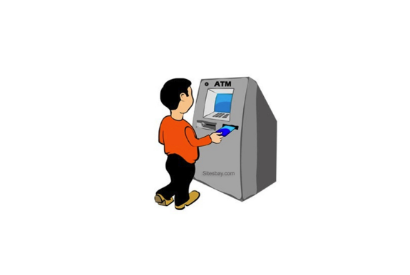
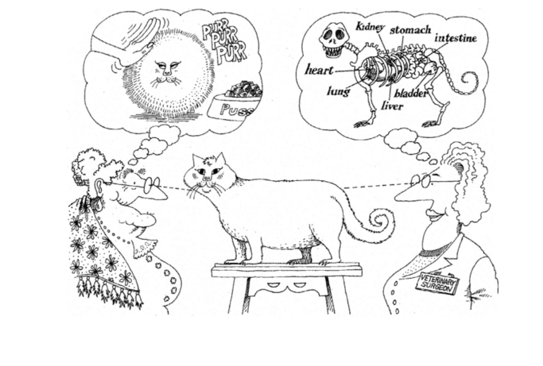
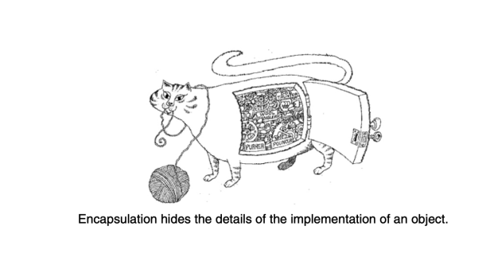
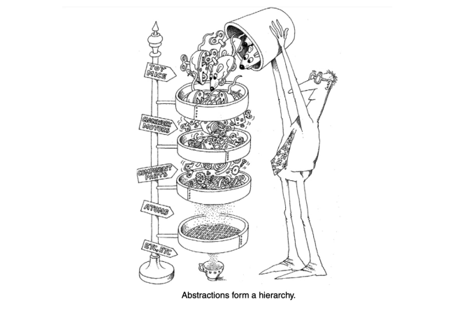

<!-- Abstraction -->

-> It is a major pillar of oops.

-> Process of getting essential things from object is called as abstraction.

-> Main goal of abstraction is to achieve simplicity.

-> According to Grady Booch, Abstraction focuses on the essential characteristics of some object,
relative to the perspective of the viewer.

Example : 

-> Implementation of abstraction is called as encapsulation.

-> Abstraction focuses on the observable behavior of an object, whereas encapsulation focuses on the
implementation that gives rise to this behavior.

