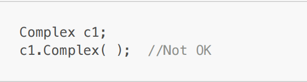
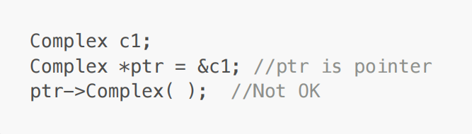
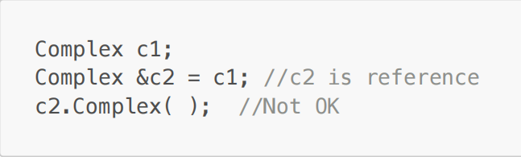
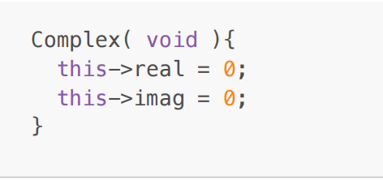
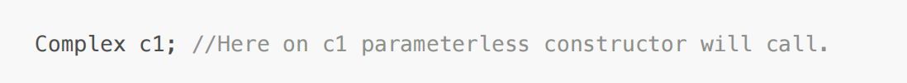
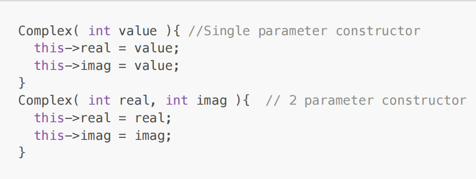
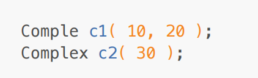
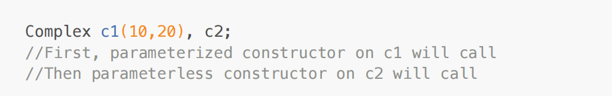
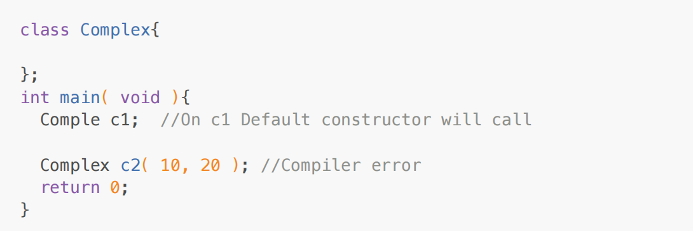

<!-- Constructor -->

Member function of a class which is used to initialize the object is called as constructor.

Note: Constructor do not create object rather it initializes object.

Due to below reasons constructor is considered as special function of the class:

Its name is always same as class name.

It does not have any return type

It is designed to call implicitly

It gets called once per instance.

We can not call constructor on object, pointer or reference explicitly.

<!-- Example : 1 -->

<!-- Example : 2 -->

<!-- Example : 3 -->

<!-- question : 1 -->

We can use any access specifier on constrctor:

If constructor is public then we can create object inside member function of the class as non
member function of the class.

If constructor is private then we can create object inside member function of the class only

We can not declare constructor static, constant, volatile or virtual but we can declare constructor
inline.

<!-- Types of constructor: -->

1. Parameterless constructor

2. Parameterized constructor

3. Default constructor.

<!-- Parameterless constructor: -->

It is also called as zero argument constructor or user defined default constructor.

Constructor of the class which do not take any parameter is called as parameterless constructor.

<!-- Example : 1 -->

If we create object without passing argument, then compile invoke parameterless constrctor.

<!-- Parameterized constructor -->

Constructor of the class which is having parameter(s) is called as parameterized constructor.

If we create object by passing arguments then parameterized constructor gets called.

<!-- We can overload constructor. -->

question: 2

<!-- Constructor calling sequence depends on order of object declaration: -->

<!-- Default constructor -->

If we do not define constructor inside class then compiler generate constructor for the class. Such
constructor is called as default constructor.

Compiler never generate parameterized constructor. In other words, compiler generated constructor
is zero argument / parameterless constructor.

<!-- Aggregate class class following properties: -->

1. It does not contain private or protected non static data member.

2. It does not contain any user defined constructor.

3. It does not have base class

