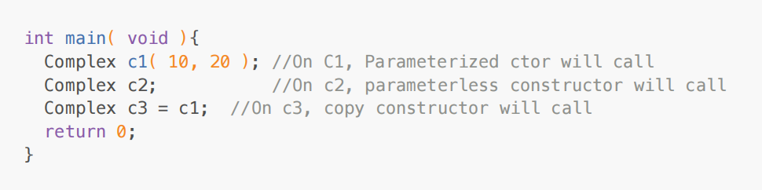

<!-- Copy constructor -->

1. If we try to intialize newly created object from exisiting object of same class then on newly created
object copy constructor gets called.

<!-- Example: -->

2. If we do not define copy constructor inside class, then compiler generate one copy constructor for
the class by default. It is called as default copy constructor.

3. Default copy constructor, by default creates shallow copy.

4. Copy constructor is a parameterized constructor of the class which take single parameter of same
type as a reference.

5. Copy constructor is not a new type of constructor. It is parameterized constructor.

 <!-- Reference Variable -->

URL :- https://www.simplilearn.com/tutorials/cpp-tutorial/cpp-reference#:~:text=Conclusion-,Introduction,variable%20name%20or%20reference%20name.

