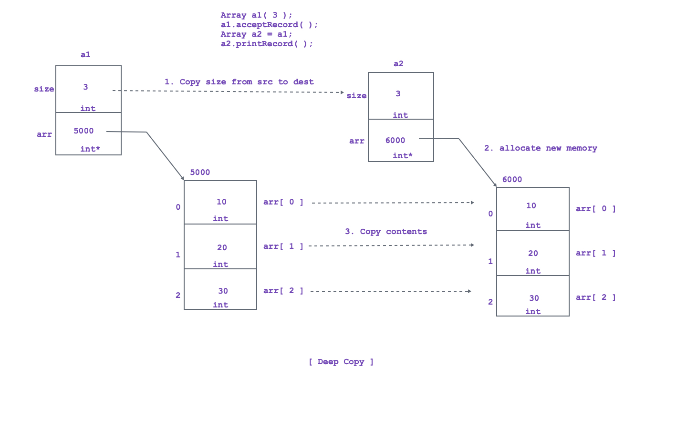

<!-- Deep Copy -->

1. If we make copy of the object with some modifications then such type of copy is called as deep copy.

<!-- Conditions to create deep copy. -->

1. Class must contain at least one pointer

2. Class must contain user defined destructor with deallocation.

3. We must create copy of the object.

<!-- Steps to create deep copy -->

1. Copy the required size from source object into destination object.

2. Allocate new resource for the pointer of destincation object.

3. Copy the contents from resource of source object into resource of destination object.

<!-- Where to create deep copy -->

1. If we pass object to the function by value ( Copy Constructor ).

2. If we return object from function by value ( Copy Constructor ).

3. If we initialize object from another object ( Copy Constructor ).

4. If we assign object from another object ( operator=( ) )

5. If we throw object ( Copy Constructor ).

6. If we catch object by value ( Copy Constructor ).

<!-- Example :  -->

