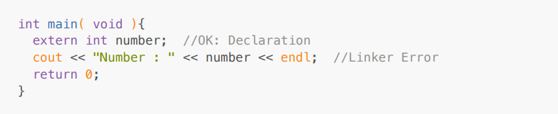
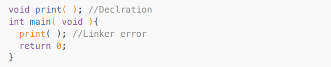
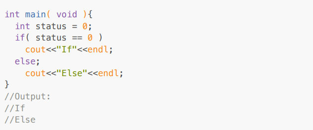
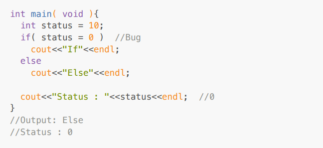
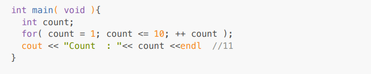
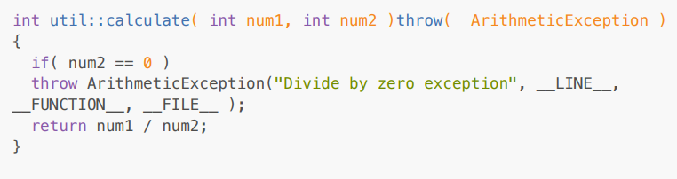

<!-- Exception Handling -->

-> If we make some syntatical mistake in the code then compiler generates error.

-> Without definition, if we try to access any member then linker generates error.

<!-- Example 1: -->

<!-- Example 2: -->

-> Logical error is called bug. In other words, syntacticaly valid but logically invalid statment represents bug.

<!-- Example 1: -->

<!-- Example 2: -->

<!-- Example 3: -->

-> Runtime error is called as exception

-> Exception is an object, which is used to send notification to the end user of the system, if any
exceptional situation occurs in the system.

-> Below are the operating system resources that we use for the application development
1. Memory
2. File
3. Thread
4. API
5. Socket
6. I/O devices
7. Processor

-> Since operating system resources are limited, we should handle it carefully. In other words, we should avoid their leakage.

-> If we want handle/manage OS resources carefully then we should use exception handling mechanism
in the code.

-> In C++, we can handle exception using 3 keywords:
1. try
2. catch
3. throw

<!-- try block -->

-> try is keyword in C++.

-> try block is also called as try handler.

-> If we want to keep watch of group of statements then we should use try block / try handler.

<!-- Example: -->

-> We can not define try block after catch block.

<!-- throw -->

-> throw is a keyword in C++.

-> If we want to generate new exception then we should use throw keyword.

<!-- catch -->

-> catch is a keyword in C++.

-> catch block is also called as catch handler.

-> To handle execption, we should use catch block/catch handler.

-> Single try block may have multiple catch blocks but it must have at least one catch block.

-> A catch block, which can handle all types of exception is called as generic catch block.

-> We must define generic catch block after all specific catch block.

-> For thrown exception, if we do not define matching catch block then C++ runtime, implicitly
give call to the std::terminate() function which implicitly give call to the std::about function.

<!-- Example :  -->

<!-- question 1: -->

<!-- Exception Specification List: -->

-> List of type(s) of exception that we specify after function name using throw keyword is called as
exception specification list.

-> Its responsibility of C++ developer to specify exception specification list.

-> If type of thrown exception is not available in exception specification list then C++ runtime implicitly give call to the std::unexpected function which internally give call to the std::terminate() function.

-> If we separate function declaration and definition then we should specify exception specification list in declaration as well as definition.

-> Using throw keyword, we can rethrow exception from netsed catch block into outer catch block:

<!-- Example :  -->

<!-- question 2: -->

-> Outer catch block can handle exception thrown from inner try block. But inner catch block can not
handle exception thrown from outer try block.

