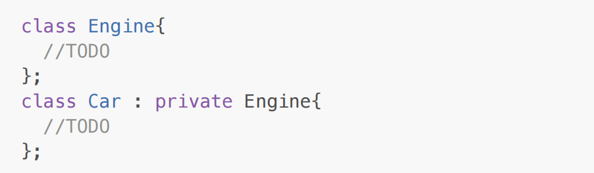

<!-- Inheritance -->

<!-- Consider below examples: -->

1. Manager is a Employee

2. Book is a Product

3. Rectangle is a Shape

4. SavingAccount is a Account

5. Car is a Vehicle

If is a relationship is exist between the types then we should use inheritance.

Inheritance is also called as generalization.

<!-- Example :  -->

class Person{ //Parent class / Base class

//TODO

};
class Employee : public Person{ //Child class / Derived class
// here public is mode of inheritance

//TODO

};

-> In C++, parent class is called as Base class and child class is called as Derived class.

-> If we create object of derived class then all the non static data member declared in base class and
derived class get space inside it. In other words, non static data member of the base class inherit into
derived class.

-> Using derived class, we can access static data member declared in base class. In other words, static
data member of base class inherit into derived class.

-> All the data members( static & non static of any access specifier ) of base class inherit into derived
class. But only non static data members get space inside object.

-> Data members of drived class, do not inherit into base class hence size of object of base class
depends on non static data members declared inside base class only.

-> Size of object of derived class = size of all the non static data members declared in base class and
derived class.

Note: private/protected/public data members( static & non static ) inherit into derived class.

-> We can call, non static member function of base class on object of derived class. In other words, non
static member function of base class inherit into derived class.

-> We can call, static member function of base class on derived class name. In other words, static
member function of base class inherit into derived class.

<!-- Below functions, do not inherit into derived class: -->

1. constructor
2. destructor
3. copy constructor
4. assignment operator function
5. friend function

<!-- Except above five functions, all the static and non static member functions of base class inherit into derived class. -->

-> During inheritance, member functions of base class inherit into derived class. Hence using derived
class object, we can call member function of base class as well as derived class.

-> During inheritance, member functions of derived class do not inherit into base class. Hence using
base class object, we can call member function of base class only.

-> Nested class of base class inherit into derived class.

-> Final Conclusion: Except constructor, destructor, copy constructor, assignment operator function and
friend function all the members of base class inherit into derived class.

-> If we create object of Base class then only base class constructor gets called.

-> If we create object of Derived class, then first base class constructor gets called and the derived
class constructor gets called. Destructor calling sequence is exactly opposite of constructor calling
sequence.

-> From any constructor of deived class, by default, base class's parameterless constructor gets called.

-> Using constructor's base initializer list, we can call, any constructor of base class from constructor of derived class.

<!-- Example:  -->

<!-- How to read below statement: -->

1. Class Person is inherited into class Employee.
2. Class Employee is derived from class Person.

<!-- In above code, local variable is hiding global variable. It is also called as shadowing -->

<!-- question:1 -->

<!-- In question, In above code, local variable is hiding data member. It is also called as shadowing -->

<!-- ************************************************************************************************************** -->

-> According client's requirement, if implementation of base class member function is logically
incomplete then we should override/redefine member function inside derived class.

-> If name of member function defined in base class & derived class is same and if we call such member
function on object of derived class then preference will be given to derived class member function

->  In this case, derived class member function hides implmentation of base class member function. It is
called as shadowing.

-> In General, to access any member of base class inside member function of derived class, we should
use class name and :: operator.

<!-- Applications of scope resolution operator: -->

1. To define member function global

2. To access members of namespace

3. To access static members

4. To access members of base class inside member function of derived class.

5. According client's requirement, if implementation of exisiting class is logically incomplete / partially
complete then to make it complete we should extend that class in other words we should create its
derived class.

6. It means we should use inheritance.

7. Process of reusing members of parent class inside child class is called as inheritance

<!-- Example :  -->

<!-- question 2: -->

<!-- Mode of Inheritance -->

-> When we use private/protected/public keyword to control visibility of members of the class inside
class, it is called access specifier. Default access specifier of class is private.

-> When we use private/protected/public keyword to create derived class then it is called mode of
inheritance.

<!-- Example : -->

In above Example, mode of inheritance is public.

<!-- Example 2: -->

In above statement, mode of inheritance is private.

<!-- In C++, default mode of inheritance is private. -->

<!-- -> If has-a relationship is exisit between the type then either we should use association or private mode of inheritance. -->

1. Car has a engine
<!-- Example 1:  -->

<!-- Example 2:  -->

<!-- If is-a relationship is exisit between the type then we should use public mode of inheritance. -->

<!-- Example: Tape( CD / DVD / Cassete ) is a Product. -->

<!-- Very Important -->

