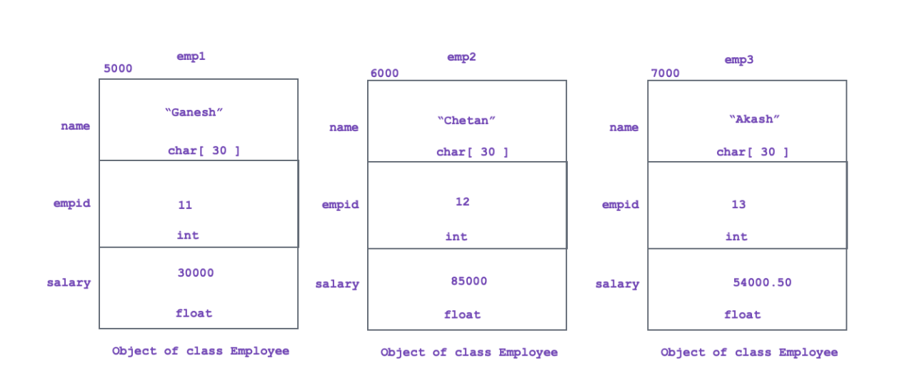
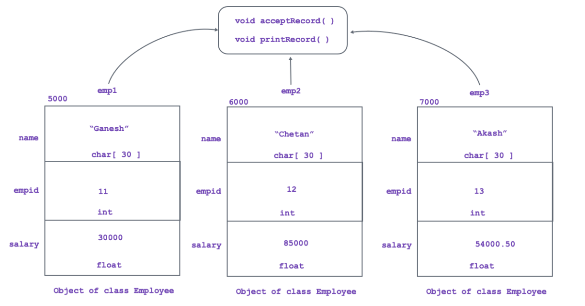
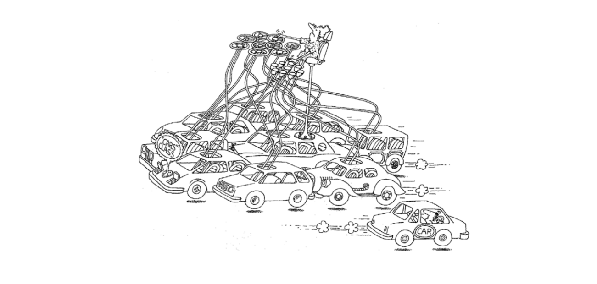
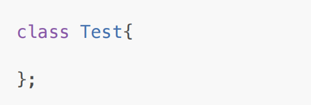
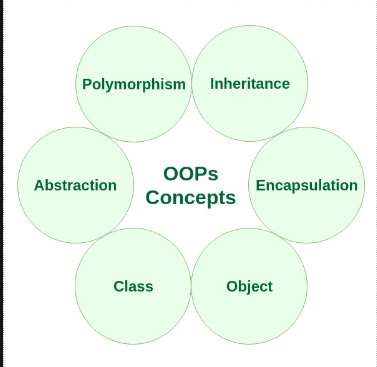

1. Only data members get space inside object. Member function do not get space inside object

2. Data members of the class get space once per object according their order of declaration inside
class.

3. 

4. Member function do not get space inside object, rather all the objects of same class share single
copy of it.

5. 

6. Size of object depdends on size of all the data members declared inside class.

<!-- 7. Characteristics of Object -->

<!-- 1. State: -->

Value stored inside object is called as state of the object.
Value of the data member represents state of the object.

<!-- 2. Behavior -->

Set of operations which are allowed to perform on object is called behavior of the object.
Member function defined inside class represents behavior of the object.

<!-- 3. Idenitity -->

Value of any data member, which is used to identify object uniquely, is called as identity of the object.
When state of objects are same then its address can be considered as its identity

<!-- Class -->

<!-- Definition: -->

Class is collection of data members and member function.

Structure and behaviour of the object depends on class. Hence class is considered as a template / model / blueprint for object.

Class represents, group of objects which is having common structure and common behavior.

Class is an imaginary / logical entity.

Example: Book, Laptop, Mobile Phone, Car.

Class implementation represents encapsulation

<!-- Image -->

<!-- Object -->

<!-- Definition: -->

Object is instance/variable of a class.

An entity which is having physical existance is called as object.

An entity, which is having state, behavior and identity is called as object.

Object is real time / physical entity.

Example: "More Effective C++", "MacBook Air", "iPhone 15", "Skoda Kushaq".

Instantiation represents abstraction.

<!-- Image : -->

<!-- Empty class -->

A class which do not contain any member is called as empty class.

<!-- Image : -->

Size of the object depends on data members declared inside class.

According to above definition, size of object of empty class should be zero.

According to oops concept, class is imaginary/logica term/entity and object is real time / physical term/entity. It means that object must get some space inside memory.

According to Bjarne Stroustrup, size of object of empty class should be non zero.

Due to compiler optimization, object of empty class get one byte space.

<!-- Characteristics of an Object-Oriented Programming Language -->

