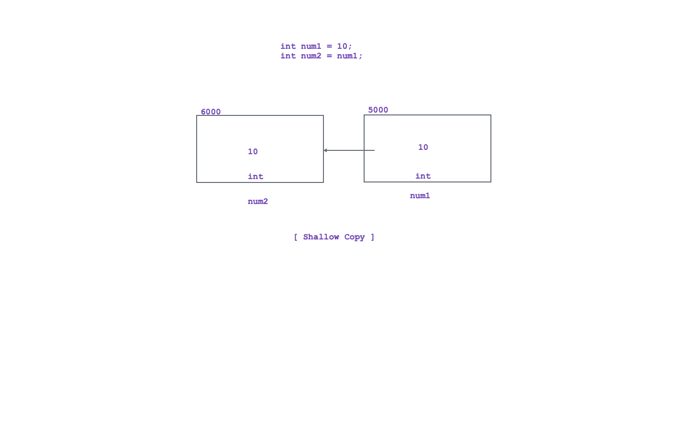
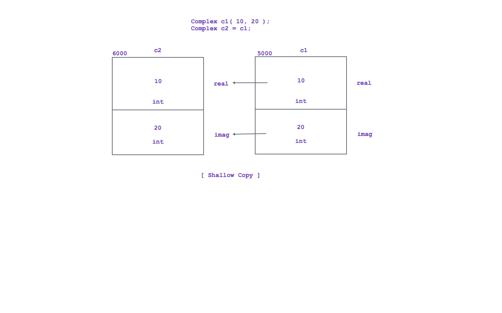

1. Proecss of copying contents from source object into destination object as it is, is called as shallow
copy.

2. Shallow copy is also called as bitwise copy / bit-by-bit copy.

<!-- Example 1: -->

<!-- Example 2: -->

