<!-- Types of inheritance -->

1. Interface inheritance

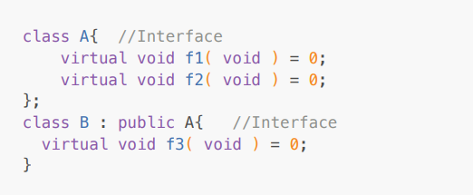

-> During inheritance, if parent type and child type is interface then such type of inheritance is
called as interface inheritance.

1. Single inheritance
2. Multiple inheritance
3. Hierarchical inheritace
4. Multilevel inheritance

<!-- mplementation inheritance -->

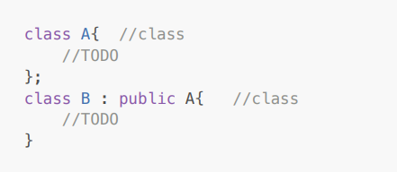

<!-- 1. Single inheritance -->

<!-- Consider below example: -->

class B is derived from class A

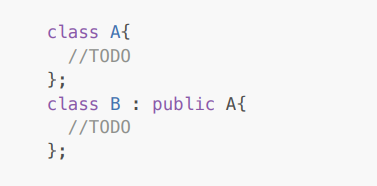

-> If single base class is having single derived class then such type of inheritance is called as single
inheritance.

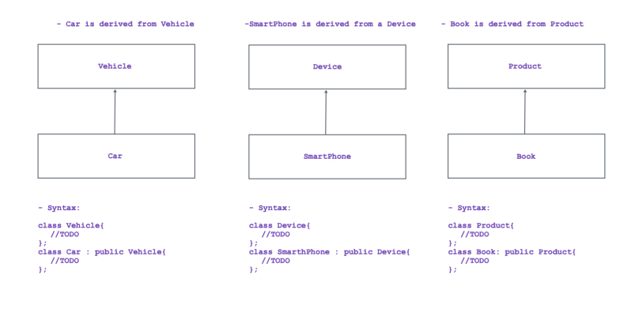

<!--2. Multiple inheritance -->

<!-- Consider below example: -->

class C is derived from class A and class B

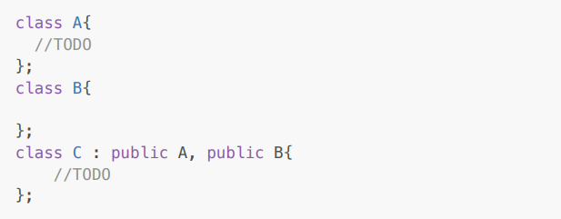

-> If multiple base classes are having single derived class then such type of inheritance is called as
multiple inheritance.

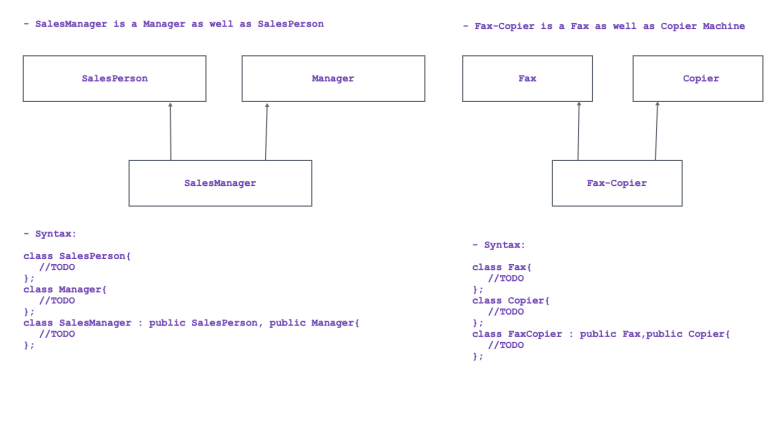

<!--3. Hierarchical inheritace -->

<!-- Consider below example: -->

class B and C are derived from class A

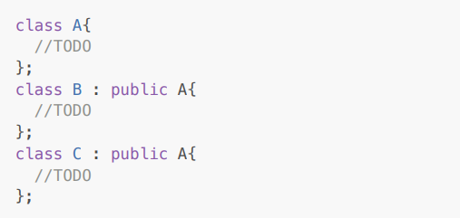

-> If single base class is having multiple derived classes then such type of inheritance is called has
hierarchical inheritance.

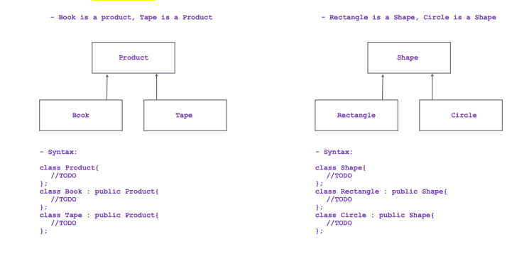

<!--4. Multilevel inheritance -->

<!-- Consider below example: -->

class B is derived from class A, class C is derived from class B and class D is derived from class C

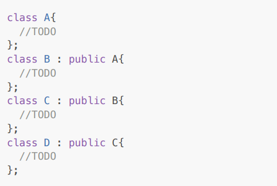

-> If single inheritance is having multiple levels then such type of inheritance is called as multilevel
inheritance

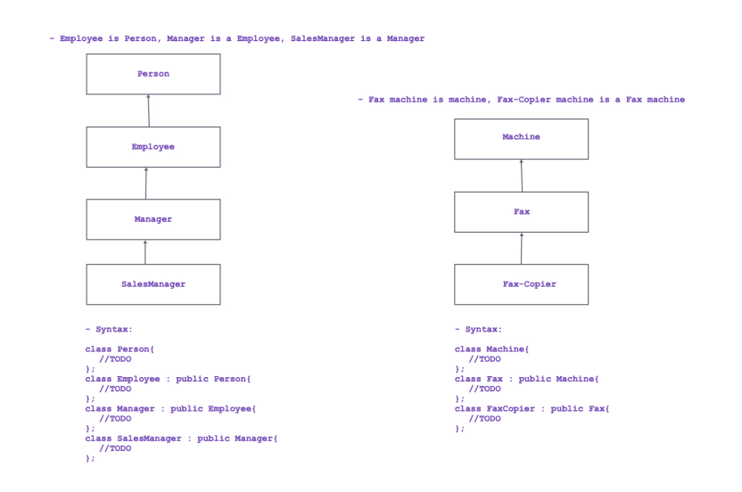

<!--5. Hybrid inheritance -->

If we combine any two / more than two types of inheritance then it is called as hybrid inheritance.

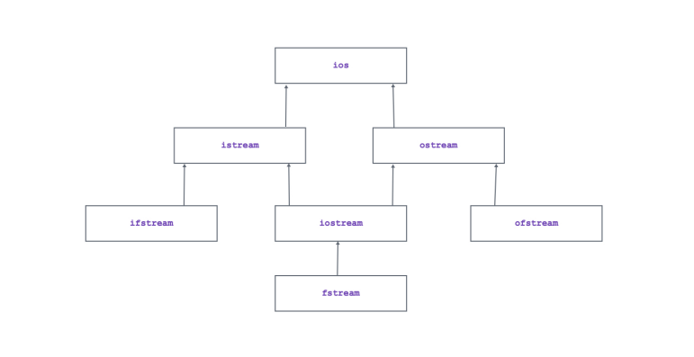

